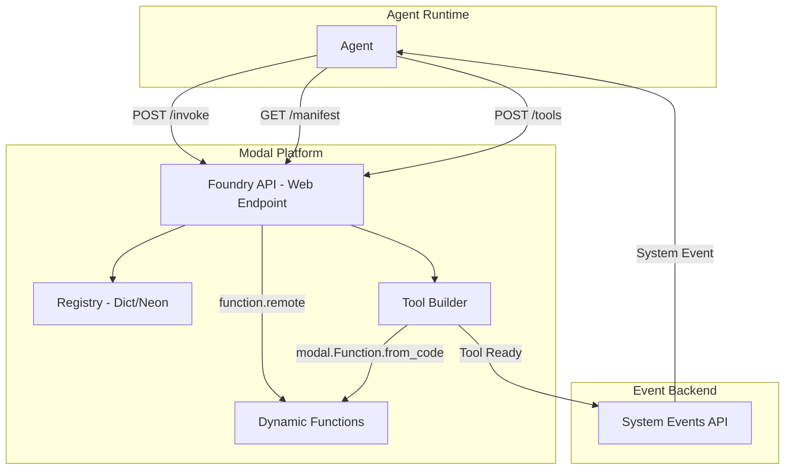

# Tool Foundry

Dynamic tool creation and execution service for AI agents. Built on [Modal](https://modal.com) for zero-infrastructure serverless deployment.

## Why Modal?

Modal is a Python-native serverless platform that's perfect for this use case:

- **Dynamic function deployment** - Deploy Python functions at runtime with a single API call
- **Built-in sandboxing** - Each function runs in isolated containers
- **No infrastructure** - No Terraform, no VPC, no IAM roles
- **Fast cold starts** - ~100-200ms
- **Native Python SDK** - Deploy with decorators or programmatically
- **Pay-per-use** - Only pay for compute time
- **Built-in secrets** - Secure secret management

## Architecture Overview



## Quick Start

### Prerequisites

- Python 3.11+
- Modal account (free tier available at https://modal.com)

### Setup (5 minutes)

```bash
# 1. Clone the repo
git clone <repo-url>
cd tool-foundry

# 2. Install dependencies
pip install modal fastapi pydantic httpx

# 3. Authenticate with Modal
modal token new

# 4. Deploy
modal deploy foundry.py
```

That's it. No Terraform, no AWS console, no VPC configuration.

### Environment Variables

Set these in Modal dashboard or via CLI:

```bash
modal secret create foundry-credentials \
  API_BASE_URL=https://api.example.com \
  API_KEY=your-event-api-key
```

### Test It

```bash
# Create a simple tool
curl -X POST https://your-workspace--tool-foundry-foundry-api.modal.run/v1/tools \
  -H "Content-Type: application/json" \
  -d '{
    "name": "add_numbers",
    "description": "Add two numbers together",
    "input_schema": {
      "type": "object",
      "properties": {
        "a": {"type": "number"},
        "b": {"type": "number"}
      },
      "required": ["a", "b"]
    },
    "implementation": "def main(a: float, b: float) -> float:\n    return a + b",
    "org_id": "test",
    "conversation_id": "test-conv"
  }'

# Invoke the tool
curl -X POST https://your-workspace--tool-foundry-foundry-api.modal.run/v1/tools/{tool_id}:invoke \
  -H "Content-Type: application/json" \
  -d '{"input": {"a": 5, "b": 3}}'
```

## API Endpoints

| Method | Endpoint | Description |
|--------|----------|-------------|
| **Health** | | |
| GET | `/health` | Health check |
| GET | `/` | API info and available endpoints |
| **Construct (Agent-Driven)** | | |
| POST | `/v1/construct` | Build tool from natural language |
| GET | `/v1/builds/{request_id}` | Check async build status |
| **Tools (Direct)** | | |
| POST | `/v1/tools` | Create tool with explicit code |
| GET | `/v1/tools` | List all tools (filter by `org_id`) |
| GET | `/v1/tools/{tool_id}` | Get tool manifest/schema |
| DELETE | `/v1/tools/{tool_id}` | Delete a tool |
| **Execution** | | |
| POST | `/v1/tools/{tool_id}/invoke` | Execute the tool |
| **Lifecycle** | | |
| POST | `/v1/tools/{tool_id}/rebuild` | Fix/rebuild a broken tool |
| POST | `/v1/tools/{tool_id}/deprecate` | Soft-delete a tool |

### Create Tool Request

```python
{
    "name": "tool_name",
    "description": "What the tool does",
    "input_schema": {
        "type": "object",
        "properties": {
            "param1": {"type": "string"},
            "param2": {"type": "number"}
        },
        "required": ["param1"]
    },
    "implementation": "def main(param1: str, param2: float = 0) -> dict:\n    return {'result': param1}",
    "dependencies": [],           # Optional: pip packages from allowlist
    "ttl_hours": 24,              # Optional: time to live (1-168 hours)
    "org_id": "your-org",
    "conversation_id": "conv-id"
}
```

### Invoke Tool Request

```python
{
    "input": {
        "param1": "value",
        "param2": 42
    }
}
```

## Security

Tools run in isolated Modal Sandboxes with strict security constraints:

| Constraint | Implementation |
|------------|----------------|
| Code validation | AST parsing for blocked patterns before deployment |
| Module restriction | Allowlist enforced at validation time |
| Egress control | Modal Sandboxes have no network by default |
| Timeout | 30s default per tool invocation |
| Memory | 256MB default per tool |
| Secrets | Tools have no access to Modal secrets |
| File system | Ephemeral, isolated per invocation |
| Subprocess | Blocked via AST analysis |

### Allowed Modules

Tools can use these Python modules:

**Standard Library:**
- `math`, `datetime`, `json`, `re`, `typing`
- `collections`, `itertools`, `functools`
- `dataclasses`, `enum`, `decimal`, `fractions`
- `statistics`, `random`, `uuid`, `hashlib`
- `base64`, `urllib.parse`, `html`, `string`
- `textwrap`, `copy`, `operator`, `numbers`, `abc`

**Third-Party Packages:**
- `pydantic`, `numpy`, `pandas`, `scipy`, `sklearn`

### Blocked Patterns

The following are explicitly blocked:
- `os`, `sys`, `subprocess`, `shutil`, `socket`
- `eval()`, `exec()`, `compile()`, `__import__()`
- `open()`, `input()`, `breakpoint()`
- Async functions (`async def`, `await`)
- Dunder attributes (`__xxx__`)

## Project Structure

```
tool-foundry/
├── pyproject.toml              # Project dependencies
├── foundry.py                  # Main Modal app
├── README.md
├── .env.example
├── src/
│   ├── __init__.py
│   ├── api/
│   │   ├── __init__.py
│   │   ├── routes.py           # FastAPI routes
│   │   └── schemas.py          # Pydantic models
│   ├── builder/
│   │   ├── __init__.py
│   │   └── validator.py        # Restricted Python validation
│   ├── registry/
│   │   ├── __init__.py
│   │   └── store.py            # Registry storage backends
│   └── events/
│       ├── __init__.py
│       └── events.py            # System event emission
└── tests/
    ├── __init__.py
    ├── test_api.py
    └── test_validator.py
```

## Tool Integration Guide

This section documents how AI agents interact with Tool Foundry via the `toolfoundry_construct` and `toolfoundry_invoke` tools.

### Overview

Tool Foundry provides two Foundry tools:

| Tool | Purpose |
|------|---------|
| `toolfoundry_construct` | Build a new tool from natural language description |
| `toolfoundry_invoke` | Execute a previously built tool |

### API Base URL

```
https://cameron-40558--toolfoundry-serve.modal.run
```

---

### 1. Constructing a Tool

**Endpoint:** `POST /v1/construct`

**When to use:** When the agent needs a capability that doesn't exist as a built-in tool.

#### Request

```json
{
  "capability_description": "Calculate BMI from height in meters and weight in kilograms",
  "org_id": "your-org",
  "conversation_id": "conv-abc123",
  "context": "User is asking about health metrics",
  "ttl_hours": 24,
  "async_build": false
}
```

| Field | Type | Required | Description |
|-------|------|----------|-------------|
| `capability_description` | string | Yes | Natural language description (10-2000 chars) |
| `org_id` | string | Yes | Organization ID |
| `conversation_id` | string | Yes | Conversation ID for tracking |
| `context` | string | No | Additional context for the AI builder |
| `ttl_hours` | int | No | Time to live (1-168, default 24) |
| `async_build` | bool | No | If true, returns immediately (default true) |

#### Response

```json
{
  "request_id": "req-570648173277",
  "tool_id": "tool-d1db3b21208b",
  "status": "ready",
  "message": "Tool created successfully",
  "manifest_url": "https://cameron-40558--toolfoundry-serve.modal.run/v1/tools/tool-d1db3b21208b",
  "invoke_url": "https://cameron-40558--toolfoundry-serve.modal.run/v1/tools/tool-d1db3b21208b/invoke"
}
```

---

### 2. Getting Tool Schema (Optional)

**Endpoint:** `GET /v1/tools/{tool_id}`

Use this to understand what inputs the tool requires before invoking.

#### Response

```json
{
  "tool_id": "tool-d1db3b21208b",
  "name": "calculate_bmi",
  "description": "Calculate BMI from height and weight",
  "status": "ready",
  "input_schema": {
    "type": "object",
    "properties": {
      "height_m": {
        "type": "number",
        "description": "Height in meters"
      },
      "weight_kg": {
        "type": "number",
        "description": "Weight in kilograms"
      }
    },
    "required": ["height_m", "weight_kg"]
  },
  "output_schema": {
    "type": "object"
  },
  "invoke_url": "https://cameron-40558--toolfoundry-serve.modal.run/v1/tools/tool-d1db3b21208b/invoke"
}
```

---

### 3. Invoking a Tool

**Endpoint:** `POST /v1/tools/{tool_id}/invoke`

#### Request

```json
{
  "input": {
    "height_m": 1.75,
    "weight_kg": 70
  }
}
```

#### Response - Typed Result Envelope

The response uses a **typed envelope** so agents can deterministically parse any result:

```json
{
  "success": true,
  "result_type": "number",
  "result": {
    "text": null,
    "number": 22.86,
    "image_base64": null,
    "table": null,
    "object": null
  },
  "raw_result": 22.86,
  "error": null,
  "execution_time_ms": 2100
}
```

#### Result Types

| `result_type` | Field to Read | Use Case |
|---------------|---------------|----------|
| `text` | `result.text` | Strings, formatted text |
| `number` | `result.number` | Numeric calculations |
| `image` | `result.image_base64` | Charts, visualizations (PNG/JPEG as base64) |
| `table` | `result.table` | List of objects/rows |
| `object` | `result.object` | Complex structured data |

#### Parsing Logic for Agents

```python
def parse_tool_result(response: dict) -> Any:
    """Parse Tool Foundry invoke response."""
    if not response.get("success"):
        raise ToolError(response.get("error"))
    
    result_type = response.get("result_type")
    result = response.get("result", {})
    
    if result_type == "text":
        return result.get("text")
    elif result_type == "number":
        return result.get("number")
    elif result_type == "image":
        return {"type": "image", "data": result.get("image_base64")}
    elif result_type == "table":
        return result.get("table")
    elif result_type == "object":
        return result.get("object")
    else:
        # Fallback to raw_result
        return response.get("raw_result")
```

---

### 4. Error Handling

#### Build Errors

```json
{
  "request_id": "req-123",
  "tool_id": null,
  "status": "failed",
  "message": "Validation failed: subprocess module is not allowed"
}
```

#### Invoke Errors

```json
{
  "success": false,
  "result_type": null,
  "result": {
    "text": null,
    "number": null,
    "image_base64": null,
    "table": null,
    "object": null
  },
  "raw_result": null,
  "error": "division by zero",
  "execution_time_ms": 50
}
```

---

### 5. Complete Agent Workflow

```
┌─────────────────────────────────────────────────────────────────┐
│ User: "What's my BMI if I'm 1.75m tall and weigh 70kg?"        │
└─────────────────────────────────────────────────────────────────┘
                              │
                              ▼
┌─────────────────────────────────────────────────────────────────┐
│ Agent: No BMI tool exists. Use toolfoundry_construct.          │
│                                                                 │
│ POST /v1/construct                                              │
│ { "capability_description": "Calculate BMI from height/weight" }│
└─────────────────────────────────────────────────────────────────┘
                              │
                              ▼
┌─────────────────────────────────────────────────────────────────┐
│ Tool Foundry: AI plans and generates tool code                 │
│                                                                 │
│ Returns: { "tool_id": "tool-abc123", "status": "ready" }        │
└─────────────────────────────────────────────────────────────────┘
                              │
                              ▼
┌─────────────────────────────────────────────────────────────────┐
│ Agent: Tool ready. Use toolfoundry_invoke.                     │
│                                                                 │
│ POST /v1/tools/tool-abc123/invoke                               │
│ { "input": { "height_m": 1.75, "weight_kg": 70 } }              │
└─────────────────────────────────────────────────────────────────┘
                              │
                              ▼
┌─────────────────────────────────────────────────────────────────┐
│ Tool Foundry: Executes tool in sandbox                         │
│                                                                 │
│ Returns: {                                                      │
│   "success": true,                                              │
│   "result_type": "number",                                      │
│   "result": { "number": 22.86 }                                 │
│ }                                                               │
└─────────────────────────────────────────────────────────────────┘
                              │
                              ▼
┌─────────────────────────────────────────────────────────────────┐
│ Agent: Parse result.number = 22.86                             │
│                                                                 │
│ Response: "Your BMI is 22.86, which is in the normal range."   │
└─────────────────────────────────────────────────────────────────┘
```

---

### 6. Available Tool Capabilities

Tools can be built for:

| Category | Examples |
|----------|----------|
| **Math/Stats** | BMI, compound interest, percentiles, statistics |
| **Data Processing** | JSON transformation, CSV parsing, data validation |
| **Visualization** | Line charts, bar charts, scatter plots (returns base64 PNG) |
| **Search** | Web search via Exa API (API key provided in sandbox) |
| **Text** | Formatting, parsing, regex extraction |

**Limitations:**
- No file system access
- No subprocess execution
- 30 second timeout
- 256MB memory limit

---

### 7. Swagger Documentation

Interactive API docs: https://cameron-40558--toolfoundry-serve.modal.run/docs

## Cost Estimate

Modal pricing is simple and usage-based:

- **CPU**: $0.192/hour per vCPU
- **Memory**: $0.024/hour per GB
- **GPU**: $1.10-$4.76/hour (if needed)

For the Foundry:
- API endpoint: ~$5-20/month (depends on traffic)
- Tool executions: ~$0.001-0.01 per invocation
- **Estimated total**: $20-50/month for moderate usage

## Development

```bash
# Install dev dependencies
pip install pytest pytest-asyncio ruff pyright

# Run linter
ruff check .

# Run type checker
pyright

# Run tests
PYTHONPATH=. pytest tests/ -v

# Local Modal development (hot reload)
modal serve foundry.py
```

## Implementation Phases

### Phase 1: MVP (Current)
- Modal app with basic web endpoints
- In-memory registry
- Code validation (blocked patterns)
- Synchronous tool execution

### Phase 2: Production
- Neon PostgreSQL for persistent registry
- System event integration with backend
- TTL management and cleanup
- Error handling and logging
- Rate limiting

### Phase 3: Enhancements
- Template library (pre-built tool templates)
- Usage analytics
- Promotion pipeline to Azure repo
- Multi-org isolation

## License

Proprietary - Foundry
# tool-foundry
